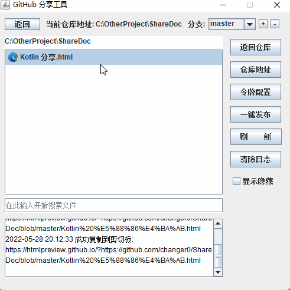
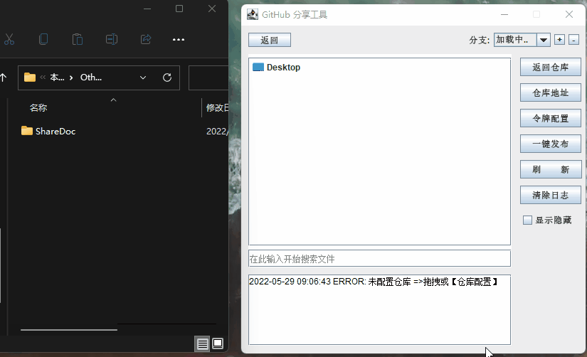
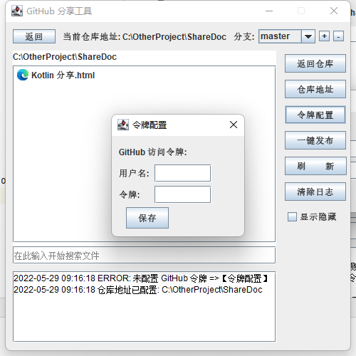

# Github 文档分享工具

[TOC]

> 用于方便生成 Github 的分享链接

预览:

## 1 使用方式

第一次使用需要配置仓库地址和 Github 令牌

### 1.1 首次配置

**创建 Git 仓库**

1. 在 Github 上建立一个文档分享仓库, 作为未来分享用 
2. 本地初始化一个 Git 仓库并关联刚才创建的远程仓库

> 注: 本软件默认仓库为 master

**配置仓库**

可以点击右侧选择【仓库地址】,也直接拖拽到软件配置仓库地址

**配置令牌**

打开 GitHub 官网,从以下路径生成令牌:

Settings -> Developer settings -> Personal access tokens

### 1.2 使用

1. 首先点击【一键发布】
2. 在想要分享的文件中右击选择【复制分享链接】
